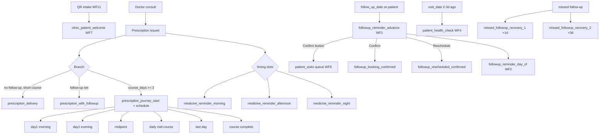

# WhatsApp Templates v2 — Implementation Logic

## Overview

v2 replaces v1 `*_v1` cards with named templates aligned to the patient care journey. Each template maps to exactly one `TWILIO_CONTENT_*` env var, one workflow trigger, and one `message_type` in `message_logs` / `message_ledger`.

**Registry:** `message-templates/templates.json` (version `2.0`)  
**Push:** `npm run generate:whatsapp-cards` → `npm run push:twilio-templates -- --submit-approval`  
**Runtime:** n8n workflows (cron + webhooks) + `prescription-delivery` edge function

---

## Care journey map

---

## Prescription delivery branch (edge function)

On `prescription-delivery` invoke after doctor issues Rx:

| Condition | Template | Env var |
|-----------|----------|---------|
| `course_days >= 3` (max parsed from `prescription_medicines.duration`) | `prescription_journey_start` | `TWILIO_CONTENT_PRESCRIPTION_JOURNEY_START` |
| `follow_up_required = Yes` and `course_days < 3` | `prescription_with_followup` | `TWILIO_CONTENT_PRESCRIPTION_WITH_FOLLOWUP` |
| Otherwise | `prescription_delivery` | `TWILIO_CONTENT_PRESCRIPTION_DELIVERY` |

**`course_days` parsing:** extract first integer from `duration` text (`"5 days"` → `5`, `"30 days"` → `30`). Use **max** across all medicines on the prescription.

**PDF delivery:** Twilio card body does not embed the PDF. After the approved template send succeeds, send the PDF as `MediaUrl` in a second message if needed, or rely on short-link in session fallback.

**Journey schedule:** when `course_days >= 3`, insert rows into `medicine_reminder_schedule` (see schema). WF14 cron sends due rows.

---

## Medicine journey schedule (doctor duration → send days)

Let `start = issue date` (clinic timezone `Asia/Kolkata`), `N = course_days`, `primary_medicine =` first medicine by sort_order.

| Day offset | Template | Cron slot | `message_type` |
|------------|----------|-----------|----------------|
| 0 (issue) | `prescription_journey_start` | immediate (edge fn) | `prescription_journey_start` |
| 1 | `medicine_journey_day1_morning` | 08:00 | `medicine_journey_day1_morning` |
| 1 | `medicine_journey_day1_evening` | 20:00 | `medicine_journey_day1_evening` |
| `ceil(N/2)` | `medicine_journey_midpoint` | 09:00 | `medicine_journey_midpoint` |
| 2 … N-1 | `medicine_journey_daily` | 08:00 each day | `medicine_journey_daily` |
| N | `medicine_journey_last_day` | 08:00 | `medicine_journey_last_day` |
| N (evening) | `medicine_journey_complete` | 20:00 | `medicine_journey_complete` |

Variables: `course_days = N`, `medicine_name = primary_medicine.medicine_name`.

**Short courses (`N` 1–2):** no journey; use **standalone** timing reminders only (see below).

---

## Standalone medicine reminders (non-journey or per-dose)

Map `prescription_medicines.timing` → slot:

| Timing values | Template | Send time |
|---------------|----------|-----------|
| Empty Stomach, Before Breakfast, After Breakfast | `medicine_reminder_morning` | 08:00 |
| Before Lunch, After Lunch | `medicine_reminder_afternoon` | 13:00 |
| Evening, Before Dinner, After Dinner, At Bedtime | `medicine_reminder_night` | 20:00 |

For each medicine × each day in `1..course_days`, insert schedule row with `schedule_kind = 'standalone'`.

---

## Follow-up reminders

| Workflow | Cron | Template | Filter |
|----------|------|----------|--------|
| WF1 | 09:00 daily | `followup_reminder_advance` | `follow_up_date = tomorrow`, `status=pending` |
| WF2 | 08:00 daily | `followup_reminder_day_of` | `follow_up_date = today`, skip `response_status=confirmed` |
| WF6 confirm | inbound | `followup_booking_confirmed` + queue insert | button/keyword confirm |
| WF6 reschedule | inbound | `followup_rescheduled_confirmed` | button/keyword cancel |

WF1 advance template includes Quick Reply buttons (`confirm_appointment`, `reschedule`) for queue confirmation (unchanged from v1 feature).

**Follow-up date format:** `en-IN` locale — `Fri, 30 May` in templates.

---

## Missed follow-up (WF3)

| Days after `follow_up_date` | Template | Env var |
|----------------------------|----------|---------|
| +1 | `missed_followup_recovery_1` | `TWILIO_CONTENT_MISSED_FOLLOWUP_RECOVERY_1` |
| +3 | `missed_followup_recovery_2` | `TWILIO_CONTENT_MISSED_FOLLOWUP_RECOVERY_2` |
| +7 | (no message) | mark `patients.status = missed` |

---

## Health check (WF4)

| Trigger | Template |
|---------|----------|
| `visit_date` 2–3 days ago, `health_check_sent=false` | `patient_health_check` |

---

## Idempotency

- Proactive sends: `message_ledger (clinic_id, patient_id, message_type, scheduled_date)` UNIQUE
- Journey schedules: `medicine_reminder_schedule (prescription_id, message_type, scheduled_date)` UNIQUE
- WF6 queue: `patient_visits` partial unique index on `(patient_id, visit_date)` for active statuses

---

## Env var migration

v2 uses **specific** env vars only. Remove `TWILIO_CONTENT_PATIENT_REMINDER` as first-choice fallback in WF1–WF5 during rollout.

See `message-templates/templates.json` for the full `twilio_content_env` per template.

---

## Deployment sequence

1. `npm run generate:whatsapp-cards`
2. `npm run push:twilio-templates -- --submit-approval`
3. Copy `HX...` SIDs from `build/twilio-template-push-results.json` → `.env`, `docker-compose.yml`, Supabase edge secrets
4. `npm run preflight` (applies `medicine_reminder_schedule` table)
5. `node tests/setup-n8n.js` (import WF14 + updated WF1–7)
6. `npm run test:wf6-button-confirmation` + integration tests
